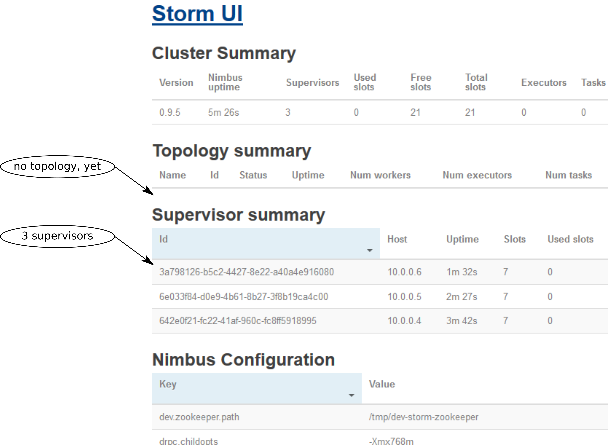

# Whalenado: A Tutorial on Deploying Apache Storm with Docker Swarm

For our upcoming **query caching and continuous query** features, we rely on [Apache Storm](http://storm.apache.org/) for low-latency data processing. Several projects have dedicated themselves to enabling multi-server Storm deployments on top of Docker (e.g. [wurstmeister/storm-docker](https://github.com/wurstmeister/storm-docker) or [viki-org/storm-docker](https://github.com/viki-org/storm-docker)), but scaling beyond server-limits always seems to make things complicated. Since scalability and ease-of-operation is key for our deployment, we have adopted Docker Swarm from the beginning and are very happy with how smoothly everything is humming along. With this tutorial, we'd like to share our experiences, raise your interest in the **Baqend Real-Time API** we'll be releasing soon and ultimately increase the hype for Docker Swarm (because it is just awesome!) :-)
 
## What we are going to do

### Outline

We will start by describing the components of our tutorial deployment and explain how everything will be working together. After that, we'll directly get to the meat and bones of this tutorial and provide a step-by-step guide on how to deploy a Docker Swarm cluster and a multi-node Apache Storm cluster on top. We will also cover some routine tasks, both related to Storm (in particular deploying a topology from a remote server) enter Swarm (e.g. restarting the manager node and killing the entire Storm cluster with one single-line statement).

### Overview: Deployment

The illustration below shows our tutorial deployment:

We'll have 3 machines running Ubuntu Server 14.04, each of which will be running a Docker daemon with several containers inside. After the initial setup, we will only talk to one of the machines, though, (`Ubuntu 1`) and it will (for the most part) just feel like having a single Docker daemon.  
When Swarm is in place, we'll set up a storm cluster on top that uses the existing ZooKeeper ensemble for coordination and deploy a topology. 

Public access to the `Ubuntu 1` machine is required (i.e. assign a public IP!), because otherwise we won't be able to have a look at the beautiful Storm UI ;-)

## Step-By-Step

We are using hostnames `zk1.openstack.baqend.com`, `zk2.openstack.baqend.com` and `zk3.openstack.baqend.com` for the three Ubuntu machines. If you do not want to set up a DNS for your ZooKeeper nodes, you can also do the entire tutorial with IP addresses.  
Just check out the [tutorial on GitHub](https://github.com/Baqend/tutorial-swarm-storm), find-and-replace our hostnames with your hostnames or IP addresses and you should be able to copy-paste most of the statements into the shell as we go along.

`10.10.100.26` --> `zk1.openstack.baqend.com`  
`10.10.100.27` --> `zk2.openstack.baqend.com`  
`10.10.100.28` --> `zk3.openstack.baqend.com`

### Prepare an image

In order to make this entire procedure not too repetitive, you'll do the preparation steps on only one of the machines, shut it down and take a snapshot (image). You will then create the other machines from this snapshot.  
So let's begin:

1. Connect to one of the servers via SSH and [install Docker](https://docs.docker.com/engine/installation/linux/ubuntulinux/). To enable calling the Docker client without `sudo`, the following will also add the current user to the Docker user group (`sudo usermod ...`):

		sudo apt-get update && sudo apt-get install apt-transport-https ca-certificates && sudo apt-key adv --keyserver hkp://p80.pool.sks-keyservers.net:80 --recv-keys 58118E89F3A912897C070ADBF76221572C52609D \
		&& echo "deb https://apt.dockerproject.org/repo ubuntu-trusty main" | sudo tee -a /etc/apt/sources.list.d/docker.list \
		&& sudo apt-get update && sudo apt-get purge lxc-docker && sudo apt-cache policy docker-engine \
		&& sudo apt-get update -y && sudo  apt-get install -y linux-image-extra-$(uname -r) apparmor docker-engine git make \
		&& sudo usermod -aG docker $(whoami)
4. Since docker uses a key file to identify individual docker daemons, you now have to stop the docker daemon, delete the key file (Docker will generate a new one after restart) and shut down the machine before taking the snapshot:

		sudo service docker stop \
		&& sudo rm /etc/docker/key.json
**Note:** If you don't remove the key file before taking the snapshot, all machines spawned from this image will have the same identifier and you'll end up with a broken Swarm cluster.  
5. The only thing left to do is to prepare the machine in such a way that it will become a Swarm worker the next time it boots. To this end, create file `/etc/init.sh` with an editor like nano

		sudo nano /etc/init.sh
and then paste the following and save:

		# the servers in the ZooKeeper ensemble:
		ZOOKEEPER_SERVERS=10.10.100.26,10.10.100.27,10.10.100.28

		# the IP address of this machine:
		PRIVATE_IP=$(hostname)
		PRIVATE_IP=$(/sbin/ifconfig eth0 | grep 'inet addr:' | cut -d: -f2 | awk '{ print $1}')

		# define label for the manager node:
		if [ $PRIVATE_IP == "10.10.100.26" ];then LABELS="--label server=manager";else LABELS="";fi
		# define default options for Docker Swarm:
		echo "DOCKER_OPTS=\"-H tcp://$PRIVATE_IP:2375 \
		    -H unix:///var/run/docker.sock \
		    --cluster-advertise eth0:2375 \
			$LABELS \
		    --cluster-store \
		    zk://$ZOOKEEPER_SERVERS\"" \
		| sudo tee /etc/default/docker

		# restart the service to apply new options:
		# in principle, a simple
		#   sudo service docker restart
		# should suffice, but sometimes it does not, so do this to make sure:
		sudo service docker stop
		sudo rm -r /var/lib/docker/network # see issue 17083; https://github.com/docker/docker/issues/17083
		sudo service docker start

		# make this machine join the Docker Swarm cluster:
		docker run -d --restart=always swarm join --advertise=$PRIVATE_IP:2375 zk://$ZOOKEEPER_SERVERS
6. But you still have to ensure that the script is only executed *once* when you spawn each Ubuntu server machine. You can choose from at least three options here:
	1. The easy way is to provide the script call (`/bin/bash /etc/init.sh`) as an init/customisation script.
	2. A more fragile way is to add the script call to `/etc/rc.local` and have the script itself remove it on execution like so:

			sudo sed -i -e "s/exit 0$/\/bin\/bash \/etc\/init.sh\nexit 0/g" /etc/rc.local \
			&& cat << EOF | sudo tee -a /etc/init.sh
				# finally comment out the script call in /etc/rc.local, so that it isn't executed again
				sudo sed -i -e "s/\/bin\/bash \/etc\/init.sh\n//g" /etc/rc.local
			EOF
	3. You can also, of course, just connect to each machine and call the script manually *after you have spawned all machines*.
5. Whichever option you chose, it is now time to shut down the machine:

		sudo shutdown -h now
6. Finally, take a snapshot of the machine, rebuild the other servers from this image and restart the machine you have taken the image from.  
7. For those who did not choose the somewhat hacky Option 2: Don't forget to make sure the  init script is called once upfront!

Time to get to the interesting stuff!

### Create the Swarm cluster

If nothing has gone wrong, you should have three Ubuntu servers, each running a Docker daemon. Every machine is already set up to become a Swarm worker node eventually, but you still have to se tup the ZooKeeper ensemble and the Swarm manager for coordination. However, you'll only have to talk to the manager node from this point on:

1. Choose `Ubuntu 1` to become the manager node and connect to it via SSH.
2. Then perform a quick health check. If Docker is installed correctly, the following will show a list of the running Docker containers (exactly 1 for Swarm and nothing else):

		docker ps
3. You are now good to launch one ZooKeeper node on every machine like this:

		docker -H tcp://10.10.100.26:2375 run -d --restart=always \
		      -p 2181:2181 \
		      -p 2888:2888 \
		      -p 3888:3888 \
		      -v /var/lib/zookeeper:/var/lib/zookeeper \
		      -v /var/log/zookeeper:/var/log/zookeeper  \
		      --name zk1 \
		      baqend/zookeeper 10.10.100.26,10.10.100.27,10.10.100.28 1
		docker -H tcp://10.10.100.27:2375 run -d --restart=always \
		      -p 2181:2181 \
		      -p 2888:2888 \
		      -p 3888:3888 \
		      -v /var/lib/zookeeper:/var/lib/zookeeper \
		      -v /var/log/zookeeper:/var/log/zookeeper  \
		      --name zk2 \
		      baqend/zookeeper 10.10.100.26,10.10.100.27,10.10.100.28 2
		docker -H tcp://10.10.100.28:2375 run -d --restart=always \
		      -p 2181:2181 \
		      -p 2888:2888 \
		      -p 3888:3888 \
		      -v /var/lib/zookeeper:/var/lib/zookeeper \
		      -v /var/log/zookeeper:/var/log/zookeeper  \
		      --name zk3 \
		      baqend/zookeeper 10.10.100.26,10.10.100.27,10.10.100.28 3
Obviously, the `-p` commands expose the ports required by ZooKeeper per default. The two `-v` commands provide persistence in case of container failure by mapping the directories the ZooKeeper container uses to the corresponding host directories. The comma-separated list of hostnames tells ZooKeeper what servers are in the ensemble. This is the same for every node in the ensemble.  
**The only variable is the ZooKeeper ID** (second argument), because it is unique for every container.
4. Now it's time to start the swarm manager:

		docker run -d --restart=always \
		      --label container=manager \
		      -p 2376:2375 \
		      -v /etc/docker:/etc/docker \
		      swarm manage zk://10.10.100.26,10.10.100.27,10.10.100.28
5. Finally, you only have to make sure that all future `docker run` statements are directed against the correct  daemon:

		cat << EOF | tee -a ~/.bash_profile
			# this node is the master and therefore should be able to talk to the Swarm cluster:
			export DOCKER_HOST=tcp://127.0.0.1:2376
		EOF
		export DOCKER_HOST=tcp://127.0.0.1:2376
This will do it for the current session and also make sure it will be done again when we log into the machine next time.

### Health Check

Now everything should be up and running fine.  
Type in

	docker info
to check cluster status on the manager node. You should see 3 running workers similar to this:

		Nodes: 3
		 docker1: 10.10.100.26:2375
		  └ Status: Healthy
		  └ Containers: 3
		  └ Reserved CPUs: 0 / 1
		  └ Reserved Memory: 0 B / 2.053 GiB
		  └ Labels: executiondriver=native-0.2, kernelversion=3.13.0-40-generic, operatingsystem=Ubuntu 14.04.1 LTS, server=manager, storagedriver=devicemapper
		  └ Error: (none)
		  └ UpdatedAt: 2016-04-03T15:39:59Z
		 docker2: 10.10.100.27:2375
		  └ Status: Healthy
		  └ Containers: 2
		  └ Reserved CPUs: 0 / 1
		  └ Reserved Memory: 0 B / 2.053 GiB
		  └ Labels: executiondriver=native-0.2, kernelversion=3.13.0-40-generic, operatingsystem=Ubuntu 14.04.1 LTS, storagedriver=devicemapper
		  └ Error: (none)
		  └ UpdatedAt: 2016-04-03T15:39:45Z
		 docker3: 10.10.100.28:2375
		  └ Status: Healthy
		  └ Containers: 2
		  └ Reserved CPUs: 0 / 1
		  └ Reserved Memory: 0 B / 2.053 GiB
		  └ Labels: executiondriver=native-0.2, kernelversion=3.13.0-40-generic, operatingsystem=Ubuntu 14.04.1 LTS, storagedriver=devicemapper
		  └ Error: (none)
		  └ UpdatedAt: 2016-04-03T15:40:15Z
The important part is the line with `Status: Healthy` for each node. If you observe something like `Status: Pending` or if not all nodes show up, even though you are not experiencing any errors elsewhere, try restarting the manager container like so 

	docker restart $(docker ps -a --no-trunc --filter "label=container=manager" | grep -v 'CONTAINER' | awk '{print $1;}')
and check again.

### Setup the Storm cluster

Now that Swarm is running, you will create an overlay network that spans all Swarm nodes and then spin up several containers for the individual Storm components.  
The Nimbus and the UI will be hosted on the manager node, whereas the supervisors (i.e. Storm workers) will be scattered across all nodes in the Swarm cluster. 

1. First, create the overlay network `stormnet` like this 

		docker network create --driver overlay stormnet
and check whether `stormnet` shows up as overlay network when you ask Docker nicely:

		docker network ls
2. Now you will start every Storm component one-by-one. Every Storm-related container will get a `cluster=storm` label, so that you will be able to easily kill the entire Storm cluster later without accidentally killing other containers.  
First, start the UI 

		docker run \
		    -d \
		    --label cluster=storm \
		    -e constraint:server==manager \
		    -e STORM_ZOOKEEPER_SERVERS=10.10.100.26,10.10.100.27,10.10.100.28 \
		    --net stormnet \
		    --restart=always \
		    --name ui \
		    -p 8080:8080 \
		    baqend/storm ui \
		      -c nimbus.host=nimbus
and the Nimbus:

		docker run \
		    -d \
		    --label cluster=storm \
		    -e constraint:server==manager \
		    -e STORM_ZOOKEEPER_SERVERS=10.10.100.26,10.10.100.27,10.10.100.28 \
		    --net stormnet \
		    --restart=always \
		    --name nimbus \
		    -p 6627:6627 \
		    baqend/storm nimbus \
		      -c nimbus.host=nimbus
To make sure that these are running on the manager node, we specified a **constraint**: `constraint:server==manager`.
3. To start 3 supervisors, fire the following statement 3 times:

		docker run \
		    -d \
		    --label cluster=storm \
		    --label container=supervisor \
			-e affinity:container!=supervisor \
		    -e STORM_ZOOKEEPER_SERVERS=10.10.100.26,10.10.100.27,10.10.100.28 \
		    --net stormnet \
		    --restart=always \
		    baqend/storm supervisor \
		     -c nimbus.host=nimbus \
		     -c supervisor.slots.ports=6700,6701,6702,6703
Since we do not care where exactly the individual supervisors are running, we did not specify any constraints here. However, in order to prevent two supervisors from being hosted on one machine unless there is no free machine available, we did specify an **affinity**: `affinity:container!=supervisor`. 
4. You can now access the Storm UI as though it would be running on the manager node: Given your manager node has a public IP, you can access the UI via `http://<manager-ip>:8080`. Make sure that you have three supervisors running. Should look something like this:

### (Remote) Topology Deployment

Deploying a topology can now be done from any server that has a Docker daemon running and is in the same network as the manager machine. The following command assumes that your topology fatjar is a file called `topology.jar` in your current working directory:

	docker run \
	   -it \
	   --rm \
	   -v $(readlink -m topology.jar):/topology.jar \
	   baqend/storm \
	     -c nimbus.host=<manager-ip> \
	     jar /topology.jar \
	       callbaq.storm.Topology \
	       topologyName=Callbaq redisURL=tcp://10.10.100.18
Since relative paths are not supported, we use `readlink -m topology.jar` which produces an absolute path for `topology.jar`. You can also provide an absolute path directly.

Killing the topology can either be done via the Storm web UI interactively or, assuming the running topology is called `runningTopology`, like this:

	docker run \
	   -it \
	   --rm \
	   baqend/storm \
	     -c nimbus.host=<manager-ip> \
	     kill runningTopology

### Shutting down the Storm Cluster

Since every Storm-related container is marked with the label (`cluster=storm`), you can kill all of them with the following statement:

	docker rm -f $(docker ps -a --no-trunc --filter "label=cluster=storm" | awk '{if(NR>1)print $1;}')

## TL; DR

As mentioned above, we have published some scripts on GitHub to ease this entire ordeal. So if you want some quick results, he are the fast-forward instructions:

1. **Preparation**: Spin up 3 Ubuntu 14.04 machines for our Docker Swarm Cluster; let's call them `Ubuntu 1`, `Ubuntu 2` and  `Ubuntu 3` with IP addresses `%IP1`, `%IP2` and `%IP3`, respectively. 
2. **Connect via SSH**: Connect to all 3 machines via SSH.
3. **Setup phase 1**: On every machine, install git, check out the repository, change director and call the `prepare.sh` script. You are only required to provide one single parameter, namely all servers that take part in ZooKeeper ensemble as a comma-separated list (`%IP1,%IP2,%IP3`):

		sudo apt-get install git -y && \
		git clone https://github.com/Baqend/tutorial-swarm-storm.git && \
		cd tutorial-swarm-storm && \
		. files/prepare.sh %IP1,%IP2,%IP3
The `prepare.sh` script will install docker, do some configuration and append some `export` statements to `~/.bash_profile` for convenience during the following installation steps. Finally, the script will reboot.
4. **Setup phase 2**: After reboot, reconnect to all 3 machines, enter the tutorial directory and call the `setup.sh` script:

		cd tutorial-swarm-storm && \
		. files/setup.sh
This script will launch a ZooKeeper node, have it join the ZooKeeper ensemble and then wait for the other ZooKeeper nodes. When the ZooKeeper ensemble is complete, the script proceeds with the installation: When executed on `Ubuntu 1`, it will setup the Swarm manager and a pure worker on node otherwise.
4. **Create an overlay network**: On the Swarm manager machine (`Ubuntu 1`), make sure you are in the `tutorial-swarm-storm` directory and call the `createNetwork.sh` script to create a network that spans all swarm nodes and have the running ZooKeeper containers join it:

       	. files/createNetwork.sh
4. **Start the Storm Cluster**: Again, on the Swarm manager make sure you are in the `tutorial-swarm-storm` directory and call the Storm launcher script. You can specify the desired number of supervisors as argument to the script:

       	. files/util/startStorm.sh 3
5. **Deploy a Topology**: 

       	. files/util/deploy-topology.sh

## Closing Remarks

In this tutorial, we demonstrated how to get a distributed Storm cluster up and running on top of Docker with a multi-node the ZooKeeper ensemble for high availability and fault-tolerance. But if you are planning to use Docker Swarm in business-critical application, you should definitely consider using **HTTPS between Swarm nodes**: In order to prevent the complexity of this tutorial from going through the roof, we let out how to [configure Docker Swarm for TLS](https://docs.docker.com/swarm/configure-tls/). However, it is definitely critical for security.

The tutorial with all resources and our Storm and ZooKeeper Docker images are available under the very permissive *Chicken Dance License v0.2*:

- **tutorial** at [GitHub](https://github.com/Baqend/tutorial-swarm-storm)
- **baqend/storm Docker image** at [Docker Hub](https://hub.docker.com/r/baqend/storm/) and [GitHub](https://github.com/Baqend/docker-storm)
- **baqend/zookeeper Docker image** at [Docker Hub](https://hub.docker.com/r/baqend/zookeeper/) and [GitHub](https://github.com/Baqend/docker-zookeeper)

Please feel free to fork us on GitHub or file a pull request if you have any improvements! 
 
We hope you enjoyed this tutorial and leave us some feedback in the comments section below!